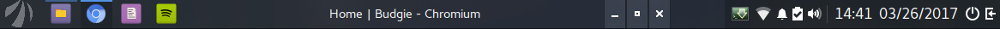

# Budgie Pixel Saver
This applet hides the title bar from maximized windows and creates a new one inside the panel. Inspired from gnome extension pixel-saver.



---

## Dependencies
```
budgie-1.0 >= 2
gnome-desktop-3.0
gtk+-3.0 >= 3.18
gdk-x11-3.0
glib-2.0
libpeas-1.0 >= 1.8.0
libwnck-3.0 >= 3.14.0
vala
```

### Installing

**From source**  
```bash
mkdir build && cd build && meson && ninja
sudo ninja install
```

### License
This program is free software; you can redistribute it and/or modify it under the terms of the GNU General Public License as published by the Free Software Foundation; either version 2 of the License, or at your option) any later version.

Workspaces applet of Budgie Desktop is used as a templete for this project. Spacer applet used as a templete in implementing settings.
